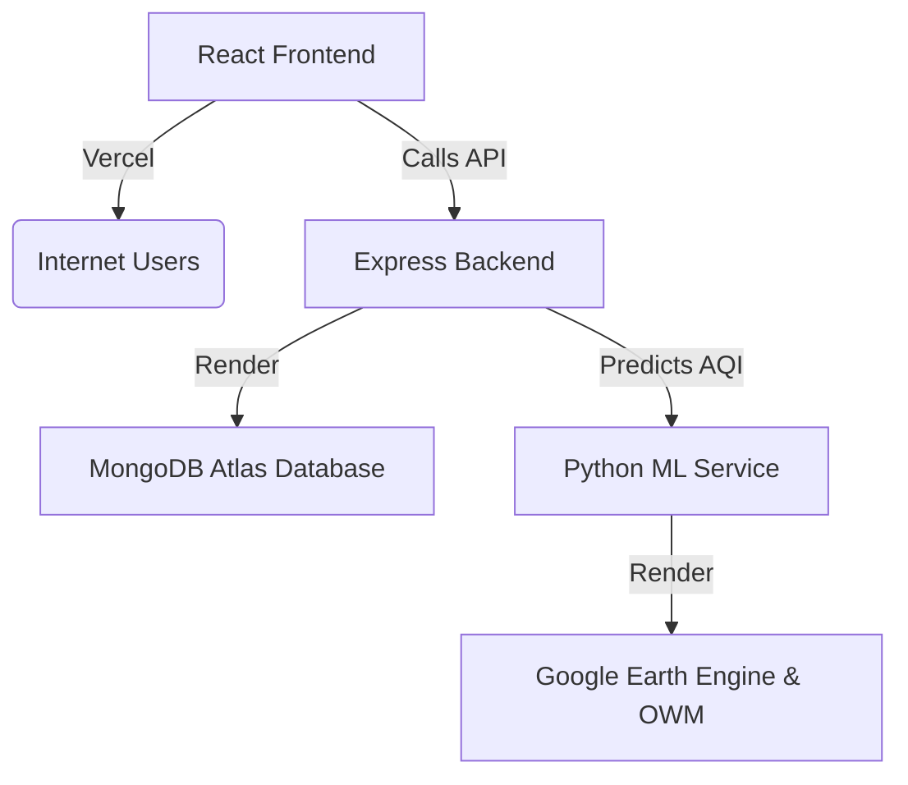

# 🚀 ClearSky Predictor: Complete Deployment Guide

Welcome! This guide will take you step-by-step through deploying your air quality predictor application. Even if you have never deployed an app before, you can follow this guide to get it live on the internet for free!

---

## 🗺️ The Deployment Map

Our application has three parts that work together:



1. **The Frontend** (Vite + React) — Hosted on **Vercel** (fast, global, and free).
2. **The Backend API** (Node.js + Express) — Hosted on **Render** (as a Web Service).
3. **The ML Service** (Python + FastAPI) — Hosted on **Render** (as a Web Service).
4. **The Database** (MongoDB) — Hosted on **MongoDB Atlas** (free cloud database).

---

## 🛠️ Step 0: Prerequisites

Before you start, make sure you have free accounts on these platforms. Sign up using the links below:
1. **GitHub Account**: [github.com](https://github.com/) (to store your code).
2. **MongoDB Atlas Account**: [mongodb.com/cloud/atlas](https://www.mongodb.com/cloud/atlas/register) (to store environmental history).
3. **Render Account**: [render.com](https://render.com/) (to run the servers).
4. **Vercel Account**: [vercel.com](https://vercel.com/) (to host the frontend website).

---

## 📂 Part 1: Push Your Code to GitHub

Render and Vercel deploy your code directly from a GitHub repository. Let's upload your project code safely.

### 1. Check your `.gitignore` file
Open your project's local directory. You will see a file named `.gitignore`. It prevents private API keys from being shared publicly on GitHub.
> [!WARNING]
> Double-check that `.env` and `gee-key.json` are listed in `.gitignore`. They should **never** be pushed to GitHub!

### 2. Create a new GitHub Repository
1. Log in to [GitHub](https://github.com/).
2. On the top-right corner, click the **`+`** icon and select **New repository**.
3. Name your repository: `clearsky-predictor`.
4. Keep it **Private** (recommended since you have custom ML files) or Public.
5. Do **not** check any boxes (like "Add a README" or ".gitignore") because your project already has them.
6. Click the green **Create repository** button.

### 3. Push your local project to GitHub
Open your terminal (PowerShell or Command Prompt) in the root of your project directory and run these commands:

```bash
# Initialize git in the folder
git init

# Add all files to be tracked (ignoring keys listed in gitignore)
git add .

# Save the files to your local repository history
git commit -m "Initial commit for deployment"

# Link your local project to the GitHub repository you just created
# (Replace your-username with your actual GitHub username!)
git remote add origin https://github.com/your-username/clearsky-predictor.git

# Rename the default branch to 'main'
git branch -M main

# Push the code to GitHub
git push -u origin main
```

---

## 🍃 Part 2: Setup MongoDB Atlas (The Database)

Since our backend needs a database to store historical records, we will set up a free cloud database.

### 1. Create a Free Cluster
1. Sign in to your [MongoDB Atlas dashboard](https://cloud.mongodb.com/).
2. Click **Create** (or **Build a Database**).
3. Select the **M0** (Free) Shared tier.
4. Choose a provider (e.g., **AWS**) and a region closest to you.
5. Click **Create** (or **Create Deployment**).

### 2. Configure Security (Crucial)
1. **Database Access (User)**:
   - Create a database user.
   - Enter a username (e.g., `clearsky_user`) and a strong password. **Write these down!**
   - Click **Create User**.
2. **Network Access (IP Whitelist)**:
   - Since Render servers change IP addresses dynamically, we must allow access from anywhere.
   - Click **Network Access** in the left-hand sidebar under *Security*.
   - Click **Add IP Address**.
   - Select **Allow Access From Anywhere** (this will fill in `0.0.0.0/0`).
   - Click **Confirm**.

### 3. Get Your Connection String
1. Go back to the **Database** (or **Clusters**) screen in Atlas.
2. Click the **Connect** button next to your cluster.
3. Select **Drivers** (or *Connect your application*).
4. Copy the connection string. It looks like this:
   ```text
   mongodb+srv://clearsky_user:<db_password>@cluster0.xxxxxx.mongodb.net/?retryWrites=true&w=majority&appName=Cluster0
   ```
5. Replace `<db_password>` with the database password you created earlier. Save this complete string somewhere safe. We will call it `MONGO_URI`.

---

## 🤖 Part 3: Deploy the ML Service on Render

We will deploy the Python FastAPI ML Service first, so the backend can link to it immediately.

### 1. Create the Web Service
1. Log in to [Render](https://dashboard.render.com/).
2. In the top right corner, click the blue **New +** button, and select **Web Service**.
3. Under **Connect a repository**, select your `clearsky-predictor` repository and click **Connect**.

### 2. Configure Settings
Fill out the creation form exactly as follows:
*   **Name**: `clearsky-ml-service`
*   **Language**: `Python`
*   **Region**: Select the region closest to your database location.
*   **Branch**: `main`
*   **Root Directory**: `ml-service`
*   **Runtime**: `Python 3`
*   **Build Command**: `pip install -r requirements.txt`
*   **Start Command**: `uvicorn app:app --host 0.0.0.0 --port $PORT`
*   **Instance Type**: Select the **Free** tier.

### 3. Add Environment Variables
Scroll down the page and click the **Advanced** button, then find the **Environment Variables** section. Add the following variables:

| Key | Value | Notes |
| :--- | :--- | :--- |
| `PYTHON_VERSION` | `3.10.12` | Ensures a stable Python build |
| `OWM_API_KEY` | *[Your OpenWeatherMap API Key]* | Same as your `VITE_OWM_API_KEY` |
| `GEE_SERVICE_ACCOUNT_JSON` | *[Contents of your `gee-key.json`]* | Open your local `gee-key.json` file in a text editor (e.g., Notepad), copy the **entire text contents**, and paste it here. |

### 4. Deploy!
1. Click **Create Web Service** at the bottom of the page.
2. Render will build and deploy the service. This may take 5–8 minutes because it installs package dependencies like TensorFlow.
3. Once the build log says `Application startup complete` and the status turns green (**Live**), copy the service URL at the top left of the dashboard (e.g., `https://clearsky-ml-service.onrender.com`).

---

## 🖥️ Part 4: Deploy the Express Backend on Render

Next, we will deploy the Node.js backend.

### 1. Create the Web Service
1. In your Render Dashboard, click the blue **New +** button and select **Web Service**.
2. Connect your `clearsky-predictor` repository again.

### 2. Configure Settings
*   **Name**: `clearsky-backend`
*   **Language**: `Node`
*   **Region**: Use the same region as the ML service.
*   **Branch**: `main`
*   **Root Directory**: `backend`
*   **Build Command**: `npm install`
*   **Start Command**: `node server.js`
*   **Instance Type**: Select the **Free** tier.

### 3. Add Environment Variables
Click **Advanced**, scroll to **Environment Variables**, and add the following keys:

| Key | Value | Notes |
| :--- | :--- | :--- |
| `NODE_ENV` | `production` | Enables production mode |
| `MONGO_URI` | *[Your Atlas Connection String from Part 2]* | The MongoDB connection URL |
| `OPENWEATHER_API_KEY` | *[Your OpenWeatherMap API Key]* | Backend key for weather fetching |
| `HUGGINGFACE_API_KEY` | *[Your Hugging Face API Key]* | Required for the chatbot panel |
| `ML_SERVICE_URL` | *[Your ML Service URL from Part 3]* | The address of your FastAPI ML service (e.g., `https://clearsky-ml-service.onrender.com`) |
| `CORS_ORIGINS` | `*` | *For now, allow all origins so we can test the connection. You can change this to your Vercel URL later.* |

### 4. Deploy!
1. Click **Create Web Service**.
2. Wait 2–3 minutes for the backend deployment to build and start.
3. When it is done, copy the backend URL (e.g., `https://clearsky-backend.onrender.com`).

---

## 🎨 Part 5: Deploy the Frontend on Vercel

Finally, let's deploy the user interface website on Vercel.

### 1. Import Project
1. Log in to [Vercel](https://vercel.com/).
2. On your dashboard, click **Add New...** (black button) and select **Project**.
3. Under **Import Git Repository**, click **Import** next to your `clearsky-predictor` repository.

### 2. Configure Settings
*   **Framework Preset**: Select **Vite** (Vercel usually auto-detects this).
*   **Root Directory**: Keep it as `./` (the default) because `package.json` for Vite is at the root.
*   **Build and Development Settings**: Leave these at their default settings (Build Command: `npm run build`, Output Directory: `dist`).

### 3. Add Environment Variables
Expand the **Environment Variables** section and add the two variables required by the frontend:

| Key | Value | Notes |
| :--- | :--- | :--- |
| `VITE_BACKEND_URL` | *[Your Render Backend URL from Part 4]* | E.g., `https://clearsky-backend.onrender.com` |
| `VITE_OWM_API_KEY` | *[Your OpenWeatherMap API Key]* | Allows map/search queries to work directly |

> [!IMPORTANT]
> Make sure there is **no trailing slash** at the end of the URL (use `https://clearsky-backend.onrender.com` instead of `https://clearsky-backend.onrender.com/`).

### 4. Deploy!
1. Click the blue **Deploy** button.
2. Vercel will build your React application. This takes less than 1 minute.
3. Once completed, you will see a screenshot of your live app and a confetti animation! Click on the screenshot or link to open your live dashboard.

---

## 💡 Troubleshooting & Production Tips

### 😴 1. The "Cold Start" Delay (Render Free Tier)
Because we are using Render's Free tier, both your backend and ML services will "go to sleep" if they do not receive requests for 15 minutes.
*   When a user first opens your website after a period of inactivity, the page might show a "Loading..." screen for 30–50 seconds while Render wakes up the servers.
*   *Solution*: For a production application, you can upgrade Render services to the "Starter" tier ($7/month) to prevent sleep.

### 🔒 2. Tightening Security (CORS)
Once your Vercel website is up and running:
1. Copy your Vercel frontend URL (e.g., `https://clearsky-predictor.vercel.app`).
2. Go to your **Render Dashboard** -> **clearsky-backend** -> **Environment**.
3. Edit the value of `CORS_ORIGINS` from `*` to your exact Vercel URL: `https://clearsky-predictor.vercel.app`.
4. Click **Save Changes**. This prevents other websites from attempting to query your backend.
